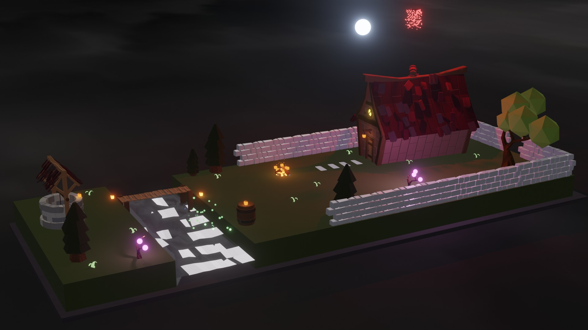
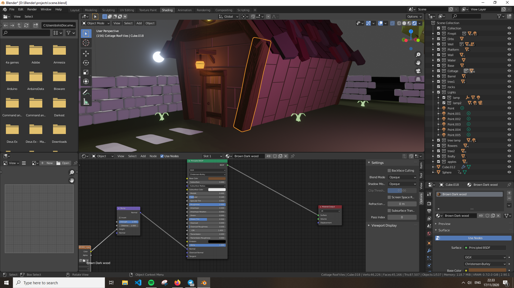

## Rendered Image

## Progress

### Objects

- [Background](./Progress/Objects/Background.md)
- [Barrel](./Progress/Objects/Barrel.md)
- [Base](./Progress/Objects/Base.md)
- [Bump Mapping](./Progress/Objects/Bump_Mapping.md)
- [Cottage](./Progress/Objects/Cottage.md)
- [Displacement Mapping](./Progress/Objects/Displacement_Mapping.md)
- [Firepit](./Progress/Objects/Firepit.md)
- [Flowers](./Progress/Objects/flowers.md)
- [Moon Sun](./Progress/Objects/Moon_Sun.md)
- [Bridge](./Progress/Objects/platform.md)
- [portals](./Progress/Objects/portals.md)
- [textures](./Progress/Objects/textures.md)
- [Tree Animation](./Progress/Objects/tree_animation.md)
- [Wall](./Progress/Objects/Wall.md)
- [Water](./Progress/Objects/Water.md)
- [Well](./Progress/Objects/Well.md)

### Tasks (w/o animation)

---

- Bump Mapping

    

- Displacement Mapping

    

- Transparency & Reflection (single model)

    

    

- Modifiers (5 types)

    Array

    ---

    

    Bavel

    ---

    

    Skin

    ---

    

    Lattice

    ---

    

    Solidify

    ---

    

- Lights (2 types)

    Sun 

    

    point

    

- Background Image

    
