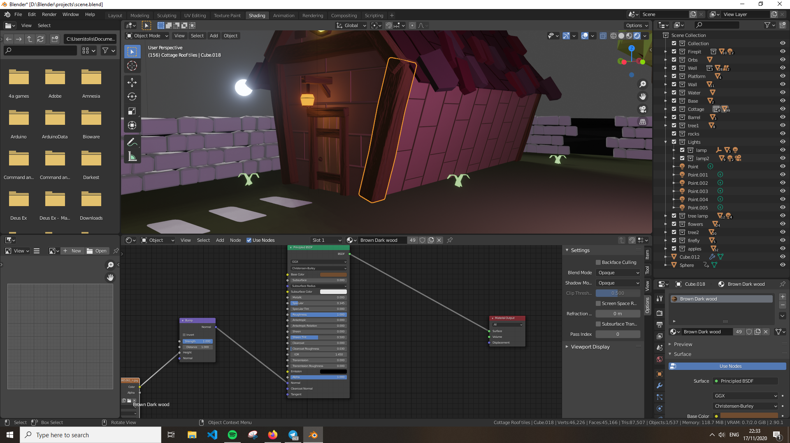

# Γραφικά

### Tasks (w/o animation)

---

- Bump Mapping

    

- Displacement Mapping

    

- Transparency & Reflection (single model)

    

    

- Modifiers (5 types)

    Array

    ---

    

    Bavel

    ---

    

    Skin

    ---

    

    Lattice

    ---

    

    Solidify

    ---

    

- Lights (2 types)

    Sun 

    

    point

    

- Background Image

    

### Scene

- [x]  Well
- [x]  House
- [x]  Falling leave Trees
- [x]  [Firepit](https://www.youtube.com/watch?v=1mJr6LDtbEM)
- [x]  Sun and Moon Rotation
- [x]  Floating barrel ([https://www.youtube.com/watch?v=UQJQW9wUIso](https://www.youtube.com/watch?v=UQJQW9wUIso))
- [x]  Ember animation tune
- [x]  Add kilos to bricks
- [x]  Displacement mapping
- [x]  Animation: grow apples
- [x]  Background Image
- [x]  Camera Placement

### Objects

- [Background](Γραφικά/Background.md)
- [Barrel](Γραφικά/Barrel.md)
- [Base](Γραφικά/Base.md)
- [Bump Mapping](Γραφικά/Bump_Mapping.md)
- [Cottage](Γραφικά/Cottage.md)
- [Displacement Mapping](Γραφικά/Displacement_Mapping.md)
- [Firepit](Γραφικά/Firepit.md)
- [Flowers](Γραφικά/flowers.md)
- [Moon Sun](Γραφικά/Moon_Sun.md)
- [Bridge](Γραφικά/platform.md)
- [portals](Γραφικά/portals.md)
- [textures](Γραφικά/textures.md)
- [Tree Animation](Γραφικά/tree_animation.md)
- [Wall](Γραφικά/Wall.md)
- [Water](Γραφικά/Water.md)
- [Well](Γραφικά/Well.md)